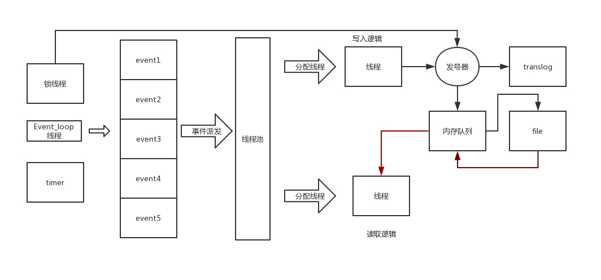

# Introduction

# Getting Started

1. 安装cmake，Macos:`brew install cmake` centos: `sudo yum install cmake`
2. 安装编译器，Macos自带了clang++，linux：`sudo yum -y install gcc gcc-c++`

# Build and Test

1. `git clone git@github.com:tiyee/angemon.git`
2. `cd angemon`
3. `mkdir build && cd build`
4. `cmake ..`
5. `make`
6. `../bin/angemon`

> 注意如果此过程提示缺少文件夹，请自行创建，比如lib,bin等

# Feature

1. 线程池支持(正在进行)
