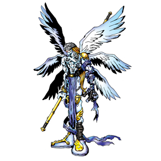

# Introduction
A simple and clarity net library.

# Getting Started

1. make sure cmake is installed if not，you can install it first 
   * Macos:`brew install cmake` 
   * centos: `sudo yum install cmake`
2. the compiler ether gcc or clang is supported，if your environment is macos，you need do nothing.if is linux,please run `sudo yum -y install gcc gcc-c++`

# Build and Test

1. `git clone git@github.com:tiyee/angemon.git`
2. `cd angemon`
3. `mkdir build && cd build`
4. `cmake ..`
5. `make`
6. `../bin/angemon`

# Test and try
run `curl 127.0.0.1:37188 -d"a=1&b=2""`

